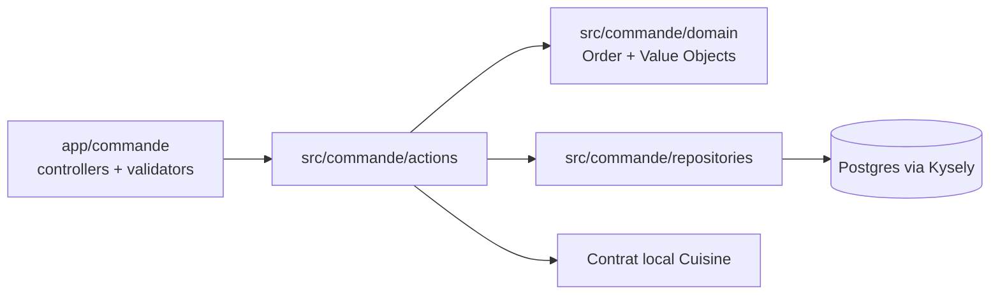
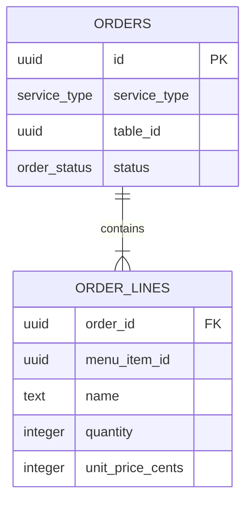

# Architecture Spine — Commande

## Design Paradigm

Le contexte `Commande` est une capacité verticale d’un monolithe modulaire pragmatique DDD. `Order` est l’agrégat de commande ; les Actions sont les points d’entrée des mutations ; les repositories possèdent le mapping Kysely ; les contrôleurs Adonis/Inertia adaptent le transport ; l’intégration vers `Cuisine` passe par un contrat local.



## Invariants & Rules

### AD-1 — L’agrégat Order possède les invariants de commande [ADOPTED]

- **Binds:** CAP-2, CAP-3, CAP-4, CAP-5
- **Prevents:** des Actions qui appliquent des transitions ou mutations incompatibles
- **Rule:** `Order` est l’unique propriétaire de ses lignes, de son type de service et des transitions `Draft`, `Confirmed`, `SentToKitchen` et `Cancelled`. Les Actions demandent une décision à l’agrégat et ne modifient pas son état interne directement.

### AD-2 — Une intention métier correspond à une Action [ADOPTED]

- **Binds:** CAP-1 à CAP-5
- **Prevents:** une Action polyvalente et des règles HTTP dans le domaine
- **Rule:** implémenter `CreateOrder`, `AddOrderLine`, `ConfirmOrder`, `SendOrderToKitchen` et `CancelOrder` comme Actions explicites avec paramètres et `Result` typés. Chaque Action possède la transaction de son écriture et persiste l’agrégat via un repository.

### AD-3 — Les lignes capturent leur valeur commerciale [ADOPTED]

- **Binds:** CAP-2
- **Prevents:** la dépendance au nom courant du menu ou aux changements de prix ultérieurs
- **Rule:** une `OrderLine` porte `menuItemId`, `name`, `quantity` et `unitPrice` capturés au premier ajout. `menuItemId` est son identité ; un ajout du même identifiant augmente la quantité au lieu de créer une ligne.

### AD-4 — Le prix est un Value Object en centimes [ADOPTED]

- **Binds:** CAP-2, persistance de Commande
- **Prevents:** arrondis, unités implicites et formats monétaires divergents
- **Rule:** le stockage persistant utilise un entier représentant les centimes. Le Value Object valide `>= 0`, expose une lecture métier et encapsule la conversion vers/depuis la représentation persistante.

### AD-5 — L’envoi à Cuisine est un contrat synchrone sans prix [ADOPTED]

- **Binds:** CAP-4
- **Prevents:** le couplage du contexte Cuisine au modèle financier et une dépendance prématurée à un bus
- **Rule:** `SendOrderToKitchen` n’est autorisé que depuis `Confirmed`. L’Action prépare le DTO puis appelle le contrat local Cuisine avec `orderId`, `menuItemId`, `name` et `quantity`; `unitPrice` reste dans Commande et n’est pas transmis à Cuisine. La transition locale vers `SentToKitchen` n’est persistée qu’après le succès du contrat Cuisine. Un rejet ou un timeout laisse la commande `Confirmed` et retourne un résultat d’intégration distinct d’un refus métier. Si Cuisine a accepté mais que la persistance locale échoue, un nouvel envoi avec le même `orderId` doit être dédupliqué par Cuisine puis permettre la persistance de `SentToKitchen`.

### AD-6 — L’envoi est idempotent [ADOPTED]

- **Binds:** CAP-4
- **Prevents:** les doublons de soumission et les effets métier répétés
- **Rule:** envoyer une commande déjà `SentToKitchen` retourne un succès sans mutation et sans nouvel appel produisant un effet métier.

### AD-7 — Les refus métier restent indépendants du transport [ADOPTED]

- **Binds:** CAP-1 à CAP-5
- **Prevents:** le couplage des Actions à HTTP, Inertia ou aux messages traduits
- **Rule:** les Actions retournent des variantes `Result` discriminées ; les contrôleurs de `app/commande` mappent ces variantes vers validation, flash, redirection ou réponse HTTP. Les exceptions sont réservées aux pannes d’infrastructure et états impossibles.

### AD-8 — Le type de service détermine la présence d’une table [ADOPTED]

- **Binds:** CAP-1
- **Prevents:** des commandes `DineIn` sans table ou `Takeaway` associées à une table
- **Rule:** `DineIn` exige un `tableId` non nul ; `Takeaway` exige un `tableId` nul. Cette règle est validée par le Value Object ou l’agrégat et renforcée par la persistance.

### AD-9 — Les opérations sur les lignes sont atomiques et protégées [ADOPTED]

- **Binds:** CAP-2
- **Prevents:** doublons de lignes ou quantités perdues lors d’ajouts concurrents
- **Rule:** `quantity` est strictement positive ; `Order` refuse toute commande vide à la confirmation et à l’envoi ; la base impose l’unicité `(order_id, menu_item_id)` et l’Action d’ajout charge/modifie l’agrégat dans une transaction avec stratégie de verrouillage ou de conflit explicite.

### AD-10 — L’intégration synchrone possède une clé d’idempotence [ADOPTED]

- **Binds:** CAP-4
- **Prevents:** deux soumissions Cuisine causées par des retries ou des appels concurrents
- **Rule:** les envois concurrents d’une même commande sont sérialisés par l’agrégat et la transaction ; le contrat Cuisine traite `orderId` comme clé d’idempotence. La commande ne devient `SentToKitchen` qu’après succès du contrat ; un échec laisse la commande `Confirmed`.

## Consistency Conventions

| Concern | Convention |
| --- | --- |
| Naming | `Order`, `OrderLine`, Value Objects métier ; fichiers en `snake_case` ; Actions impératives ; contrat d’intégration nommé selon l’action ou l’événement métier. |
| Data & formats | Identifiants typés ; prix en centimes ; dates persistées selon la convention Postgres existante ; DTO Cuisine distinct du modèle de commande. |
| State & errors | Toute transition passe par `Order` ; transaction détenue par l’Action publique ; refus attendus via `Result` ; mapping HTTP dans `app` ; transitions exactes : Draft→Confirmed, Confirmed→SentToKitchen, Draft/Confirmed→Cancelled. |
| Integration | Contrat Cuisine borné par timeout ; `orderId` sert de clé d’idempotence ; le résultat d’intégration est observable et distinct du refus métier. |
| Dependencies | `app/commande` peut dépendre de `src/commande` ; `src/commande` ne dépend ni de `app` ni de `inertia`. |

## Stack

| Name | Version |
| --- | --- |
| Node.js | >= 24.0.0 |
| AdonisJS Core | 7.4.0 |
| Inertia React | 3.7.0 |
| React | 19.x (catalogue Yarn) |
| PostgreSQL | 18 |
| Kysely | 0.29.5 |
| TypeScript | catalogue Yarn |
| Yarn | 4.17.0 |

## Structural Seed

```text
apps/web/
  app/commande/
    controllers/       # adaptation HTTP/Inertia, au plus render/execute
    transformers/      # formes de sortie si nécessaires
    routes.ts          # routes de la capacité
  src/commande/
    actions/           # une intention métier par Action
    domain/            # Order, OrderLine, états, Value Objects
    repositories/      # mapping agrégat ↔ Postgres/Kysely
    integrations/      # contrat local vers Cuisine, timeout et idempotence
    queries/           # projections de lecture si une UI les requiert
  database/migrations/ # contraintes relationnelles finales
```



## Capability → Architecture Map

| Capability / Area | Lives in | Governed by |
| --- | --- | --- |
| CAP-1 créer | `src/commande/actions/create_order.ts` | AD-2, AD-7 |
| CAP-2 ajouter et fusionner une ligne | `src/commande/actions/add_order_line.ts`, `src/commande/domain/order.ts` | AD-1, AD-3, AD-4 |
| CAP-3 confirmer | `src/commande/actions/confirm_order.ts`, `src/commande/domain/order.ts` | AD-1, AD-7 |
| CAP-4 envoyer en cuisine | `src/commande/actions/send_order_to_kitchen.ts`, `src/commande/integrations/` | AD-1, AD-5, AD-6 |
| CAP-5 annuler | `src/commande/actions/cancel_order.ts`, `src/commande/domain/order.ts` | AD-1, AD-7 |

## Deferred

- Garantie de livraison durable, outbox, retries et déduplication inter-processus : à décider lorsque `Cuisine` devient un consommateur séparé ou qu’une exigence de reprise est établie.
- Schéma exact des tables, clés étrangères vers `Menu` et `Table`, index et stratégie de verrouillage : à fixer avec la migration et le code réel.
- La forme exacte des erreurs d’intégration, les valeurs de timeout et le canal de métriques/logs : à fixer avec le runtime et l’exploitation ; la séparation succès/refus/erreur inattendue reste obligatoire.
- Autorisation, identité de l’utilisateur opérateur et audit : hors périmètre de la spec Commande initiale.
- Modification après confirmation, paiement, disponibilité du menu et suivi détaillé en cuisine : explicitement hors périmètre initial.
- Projection de lecture et écran final : à définir lorsqu’un besoin UI concret existe.
