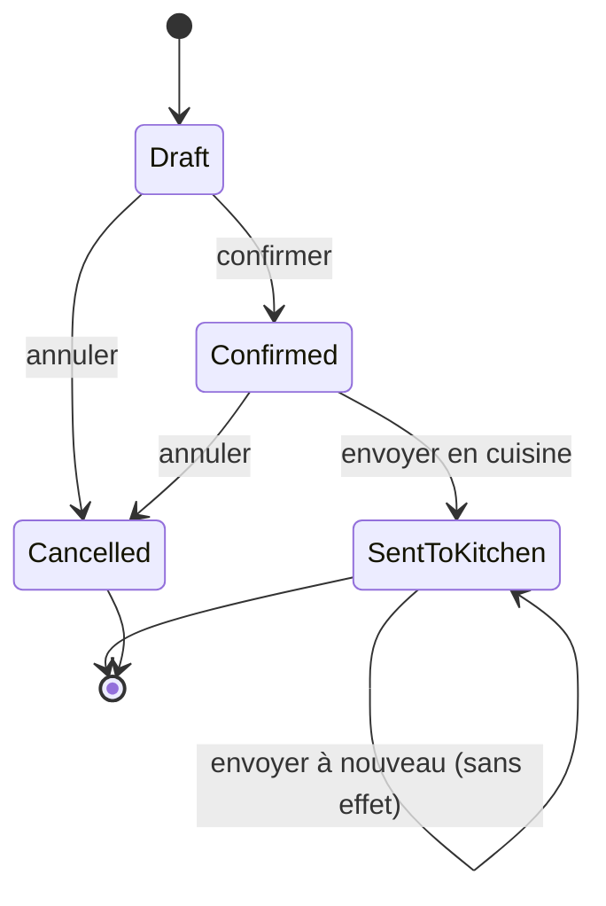

# Cycle de vie de la commande

Règles associées :

- `Draft` accepte les ajouts, modifications et suppressions de lignes.
- `Confirmed` n’est pas modifiable dans le flux initial.
- `SentToKitchen` est terminal pour le contexte `Commande`.
- `Cancelled` est terminal.
- Une commande ne peut être confirmée que si elle contient au moins une ligne.
